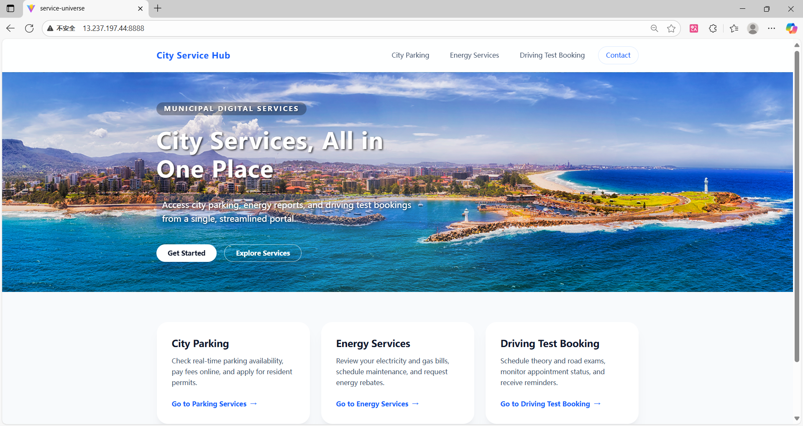
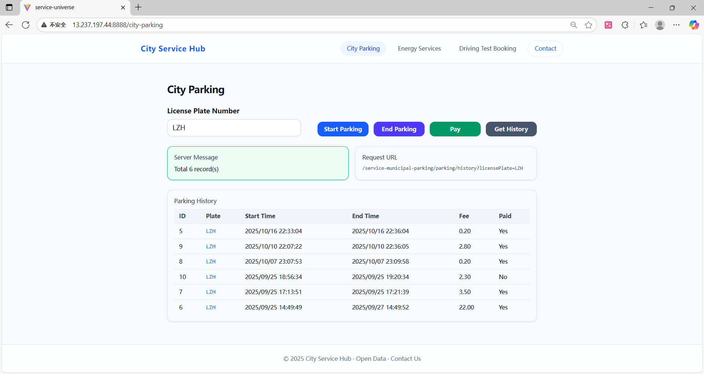
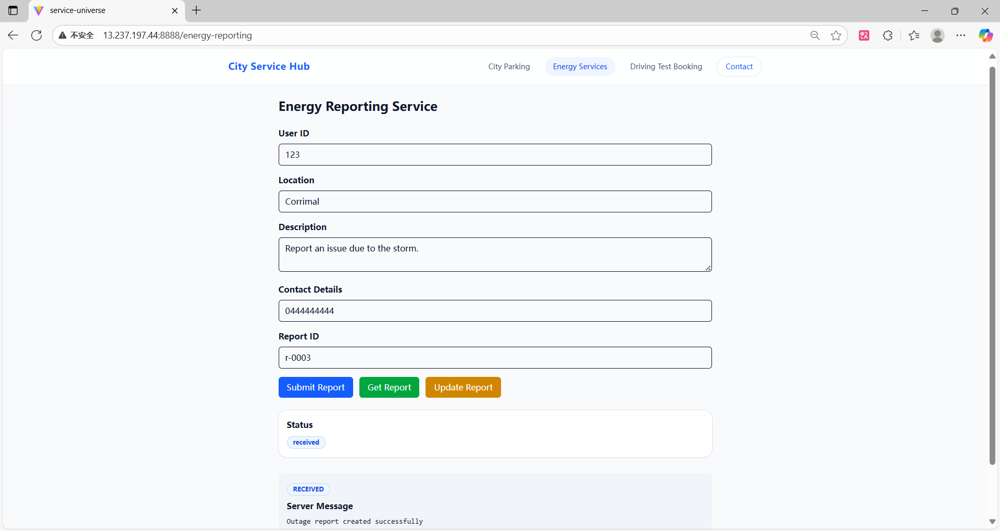
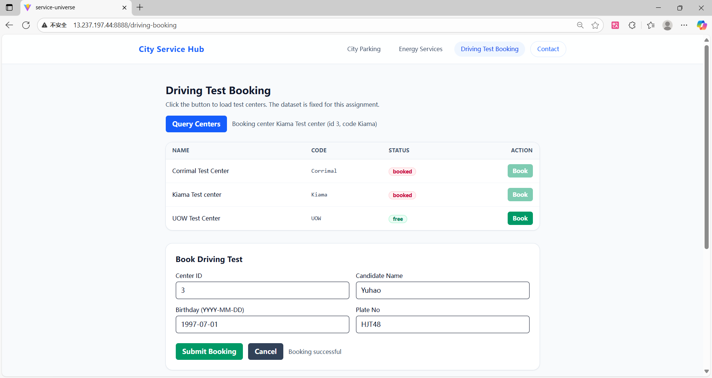
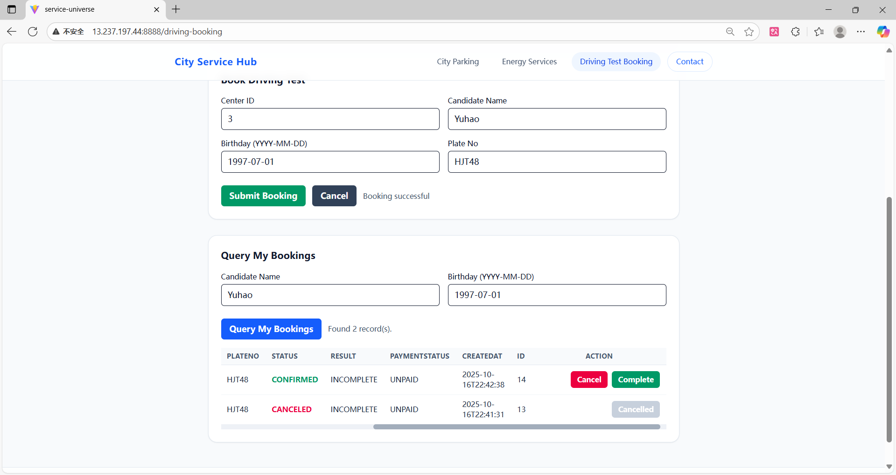

# 🚀 Service Universe: Microservices Ecosystem
**Service Universe** is a comprehensive microservices demonstration system built with **Spring Boot, Spring Cloud, and Docker Compose**. It showcases the end-to-end implementation of microservices decomposition, service registration/discovery, API gateway routing, and non-intrusive business process logging for analytics.

---

## 🎯 Project Objectives

* Demonstrate **independent deployment and communication** of distributed services.
* Implement **Service Registration & Discovery** (Eureka) and **API Gateway Routing** (Gateway).
* Provide diverse business APIs, including Municipal Parking, Energy Reporting, and Driver Booking.
* Utilize **Spring AOP** for automated, non-intrusive business logging to generate standardized datasets for **Disco Process Mining**.
* Enable **one-click deployment** of the entire microservices stack via Docker Compose.

---

## 📸 System Screenshots & Demo

### Core Business & Service Management

<p align="left">





</p>

### Process Mining Analysis (Disco)

> Visualized business process flows reconstructed from automated system logs using Disco.

---

## 📂 Project Structure & Modules

```text
service-universe/
│── eureka/                         # [Service Registry] Manages registration of all microservice instances
├── gateway/                        # [API Gateway] Unified entry point, routing, and authentication
├── service-municipal-parking/      # [Business Service] Municipal parking management module
├── service-energy-reporting/       # [Business Service] Energy data reporting module
├── service-driver-booking/         # [Business Service] Driving test booking module
├── logs/                           # [Log Directory] Centralized storage for JSON process logs
├── scripts/                        # [Utility Scripts] Includes SQL migrations and Python ETL scripts
└── docker-compose.yml              # [Orchestration] One-click setup for services and databases

```

---

## ⚙️ Technology Stack

| Category | Technology |
| --- | --- |
| **Backend Framework** | Spring Boot 3.x |
| **Microservices** | Spring Cloud (Eureka, Gateway) |
| **Persistence** | MyBatis + MySQL 8.0 |
| **Logging & Monitoring** | Logback + Custom Spring AOP |
| **Deployment** | Docker + Docker Compose |
| **Data Analytics** | Python, Disco (Process Mining) |

---

## 📈 Core Mechanism: Process Logging & Analytics

The system leverages **Spring AOP (Aspect-Oriented Programming)** to automatically capture business activities without polluting the core business logic.

### 1. Log Format (JSON)

```json
{
  "activity": "createParking",
  "resource": "ParkingService",
  "caseId": "ABC12333",
  "timestamp": "2025-09-25T19:25:10"
}

```

### 2. Implementation Details

* **`ProcessLogAspect.java`**: Intercepts Controller or Service methods using AspectJ pointcuts.
* **`ProcessLogger.java`**: Standardizes log output to ensure compatibility with Process Mining data requirements.
* **`scripts/trans_log.py`**: A Python-based ETL script that cleanses distributed logs and converts them into CSV format for easy import into Disco.

---

## 🌐 Getting Started (Deployment)

### 1. Prerequisites

* JDK 17 or higher
* Maven 3.8+
* Docker & Docker Compose
* **Frontend Project (Optional)**: For a complete UI experience, please refer to the [City-Service-Hub](https://github.com/MingcanYang/City-Service-Hub) repository.

### 2. Backend Deployment Steps

Run the following commands in the project root directory:

**Build Project** (Clean and package artifacts)

```bash
mvn clean package -DskipTests

```

**One-Click Spin-up** (Launch Eureka, Gateway, MySQL, and all Microservices)

```bash
docker compose up -d

```

### 3. Service Access

* **Service Registry (Eureka)**: `http://localhost:8761`
* **API Gateway Entry**: `http://localhost:8080/{service-name}/{endpoint}`

---

## 🔹 Engineering Highlights

* ✅ **Non-Intrusive Observability**: Decouples business logic from audit logging via AOP.
* ✅ **Data-Driven Insights**: Direct integration with Disco allows for visualized bottleneck analysis.
* ✅ **Production-Ready Architecture**: Covers key components of modern microservices governance.
* ✅ **Full-Stack Potential**: Seamlessly integrates with the City-Service-Hub frontend.

---